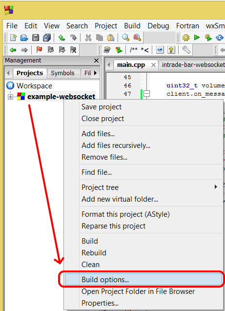
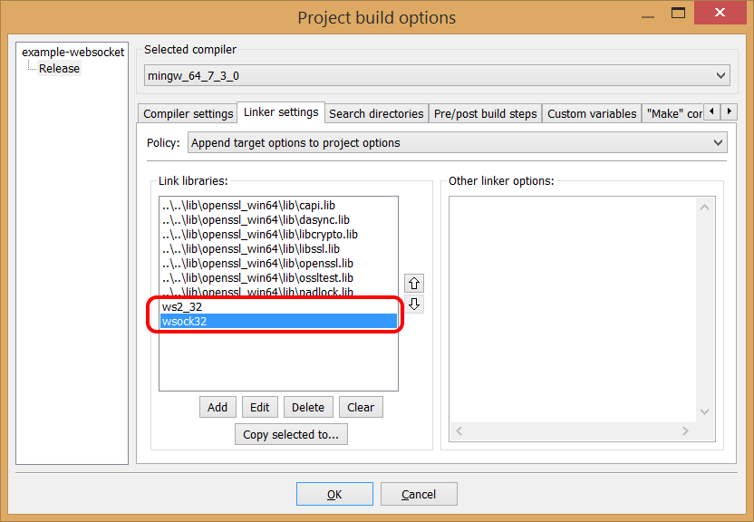

# Инструкция по установке BOOST

1) Скачиваем boost [здесь](https://www.boost.org/), рекомендую последнюю версию (библиотека тестировалась на версии **1.71.0**).

2) Распаковываем. В папке boost запускаем скрипт *bootstrap.sh* или bat-файл *bootstrap.bat*. Таким образом мы создаем инструмент *b2* для дальнейших настроек и сборки *boost*.
Запуск с компилятором *mingw* выглядит так:

```
bootstrap.bat gcc
```

**Внимание! Не забудьте добавить путь к вашему компилятору в PATH!**

Про установку компилятора *mingw* читайте в *MINGW_INSTALL.md*

3) Если нужно скомпилировать под *mingw*, открываем командную строку, перемещаемся в папку с *boost*, и выполняем в командной строке следующую команду:

```
b2 install toolset=gcc --build-type=complete release --prefix="<ваш путь к папке>" --with-system --with-date_time --with-random link=static runtime-link=static threading=multi
```

* *toolset=gcc* определяет тип компилятора. 
* *--build-type=complete* построит все поддерживаемые варианты библиотек
* *--with-system* и другие *--with-* параметры необходимы для сборки необходимых библиотек только для *asio*.

4) Для библиотеки *intrade-bar-api-cpp* из *boost.asio* нужны только заголовочные файлы. Поэтому не забудьте в проекте добавить путь к заголовочным файлам.
Например: "..\..\lib\boost_1_71_0\include\boost-1_71".

5) *boost.asio* зависит от библиотек *ws2_32* и *wsock32*, не забудьте добавить их в свой проект.
Пример для *Code::Blocks*:




6) Теперь вы подключили *boost.asio*.

