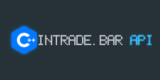

# intrade-bar-api-cpp

C++ header-only api для работы с брокером [intrade.bar](https://intrade.bar/)

## Описание

*C++ header-only* библиотека для торголи на торговой площадке [https://intrade.bar/](https://intrade.bar/)
На данный момент библиотека находится в разработке.

## Исторические данные

Исходный код программы для загрузки исторических данных  находится здесь *code_blocks/intrade-bar-downloader*.
Готовая сборка программы находится в папке *bin*, недостающие *dll* файлы можно найти в *bin/dll.7z*.

## Как начать использовать

Библиотека *intrade-bar-api-cpp* имеет следующие зависимости:

- *boost.asio*
- *openssl*
- *curl*
- *Simple-WebSocket-Server*
- *zstd*
- *zlib*
- *zlib*
- *gzip-hpp*
- *json*
- *banana-filesystem-cpp*
- *xtime_cpp*
- *xquotes_history*

Несмотря на то, что зависимостей достаточно много, установить все это не так сложно. Многие библиотеки здесь являются *header-only* или достаточно лишт добавить *.cpp* файлы в проект.

Начнем по порядку. 
- Если вы хотите использовать компилятор *mingw*, прочитайте инструкция по установке в файле *MINGW_INSTALL.md*.
- Инструкция по установке *boost.asio* представлена в файле *BOOST_INSTALL.md*.

